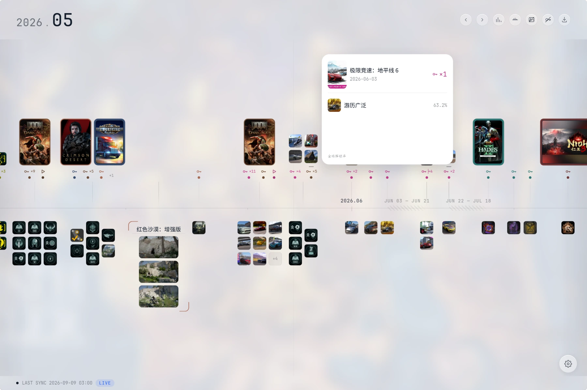
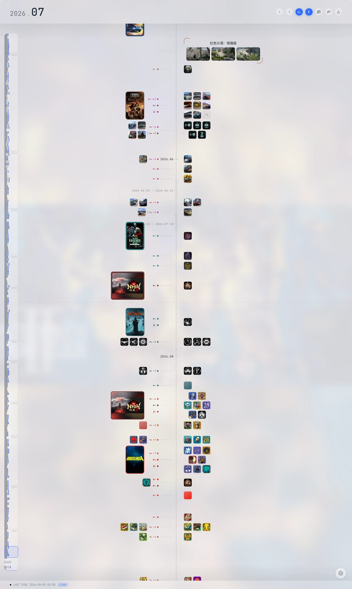

# Save Point

[](LICENSE)
[](https://www.python.org/downloads/)
[](#环境要求)
[](#安全模型)

将 Steam 的购买、首次启动、成就解锁与游戏内截图聚合到单一时间轴。

自托管单机应用：后端以用户自持的 Steam Web API Key 采集数据并落盘到本地 SQLite，前端在浏览器中渲染。无账号体系，无第三方数据传输，不提供二进制分发。



<p align="center">
  
</p>

<p align="center"><sub>上：横向时间轴，封面按购买/游玩日期排布，轴下方为当日成就与截图。下：纵向布局，左侧年份标尺支持跨年跳转。</sub></p>

---

## 环境要求

| 组件 | 要求 |
|---|---|
| Python | ≥ 3.11。Windows 安装时勾选 **Add python.exe to PATH** 与 **py launcher** |
| 浏览器 | 支持原生 ES Modules 的现代浏览器 |
| Steam 账号 | 「游戏详情」隐私设置须为**公开**，否则上游接口不返回游戏库与成就数据 |
| 仓库路径 | 不含非 ASCII 字符与空格——virtualenv 在此类路径下行为不稳定 |

无 Node.js 运行时依赖。

## 部署

```bash
git clone https://github.com/neronotdante/Save_POINTS.git
```

执行根目录的 `run.cmd`，它完成 venv 创建、依赖安装与后端启动，就绪后打开 `http://127.0.0.1:8000/`。首次执行含依赖安装，约一至三分钟。

认证经 Steam OpenID 2.0：整页跳转至 `steamcommunity.com` 完成授权，回调仅携带 SteamID64，凭据不经过本项目。

非 Windows 环境参见 [开发](#开发)。

## API Key 绑定

数据采集依赖 Steam Web API Key，OpenID 登录不附带该凭据，须单独申请：

1. 以登录所用的同一账号访问 <https://steamcommunity.com/dev/apikey>
2. 域名字段填 `localhost` 并注册
3. 将 32 位 Key 粘贴至应用完成绑定

绑定时后端以该 Key 调用一次用户资料接口做有效性校验，失败则拒绝写入。入库前经 Fernet 对称加密，接口与界面均不回显明文。

CLI 绑定（凭据不经浏览器、不入 shell 历史）：

```bash
cd backend && .venv\Scripts\activate && game-calendar-bind-apikey
```

该 Key 仅用于拉取绑定账号自身的数据。

## 首次同步

绑定后自动触发。需逐 appid 请求商店接口获取名称、封面与发售日期，受上游限流约束：

| 库容量 | 预计耗时 |
|---|---|
| < 100 | 数分钟 |
| 300 – 500 | 20 – 40 分钟 |
| > 1000 | 一小时以上 |

进度经当前页面的连接推送，关闭标签页会中断本轮采集；已入库数据不受影响，下次同步自断点续采。进度页提供「先查看已有数据」入口。增量同步通常在两分钟内完成。

## 数据与备份

持久化数据均位于 `backend/`：

| 路径 | 内容 | 备份 |
|---|---|---|
| `game_c.db`（WAL 模式下含 `-wal` / `-shm`） | 游戏库、运行日、成就、截图记录、密文 Key | 必须 |
| `fernet.key` | 加密密钥，首次启动生成 | 必须，与数据库同步备份 |
| `.env` | 配置覆盖项 | 视情况 |
| `.venv/` | 依赖 | 否，可由 `run.cmd` 重建 |

缺失 `fernet.key` 的数据库备份无法解密其中的 API Key，恢复后需重新绑定。

设置页 → DATA → 导出 JSON 备份产出的文件不含任何凭据；首启页的「导入本地备份」可在无后端的情况下只读加载该文件。

## 安全模型

- **加密密钥**：首次启动于 `backend/fernet.key` 生成，每机独立。密钥轮换会使已存 Key 无法解密。可经 `GC_SECRET_KEY` 或 `GC_FERNET_KEY` 显式指定。
- **会话**：`localStorage` 中的 30 天随机 token，服务端仅存其哈希。
- **监听地址**：默认绑定 `127.0.0.1`。项目未针对公网多用户场景加固，不应直接暴露于公网；如需跨设备访问，需自行处理反向代理、TLS 与 CORS 白名单。
- `game_c.db*`、`fernet.key`、`.env` 已列入 `.gitignore`。

## 开发

```bash
cd backend
python -m venv .venv
source .venv/bin/activate        # Windows: .venv\Scripts\activate
pip install -e ".[dev]"
uvicorn app.main:app --host 127.0.0.1 --port 8000
```

后端托管 `timeline/` 静态资源，前后端同源。独立静态服务（便于禁用缓存）：`python timeline/serve.py 5173`，该来源已在默认 CORS 白名单内。

测试：`cd backend && pytest`。迁移：`alembic upgrade head`。全部配置项及说明见 [`backend/.env.example`](backend/.env.example)。

```
backend/        FastAPI 后端，兼作前端静态资源服务
  app/          api 路由 · core 基础设施 · models · schemas · services 采集与聚合 · tasks 定时
  alembic/      数据库迁移
  sidecar/      Node 登录侧车，用于购买历史，未接入界面
timeline/       前端，原生 ES Modules，无构建步骤
GAMEC/          产品与设计文档（Obsidian 库）
game-calendar/  已归档的 Electron 月历原型
```

扩展文档：[后端](backend/README.md) · [前端规范](timeline/docs/前端开发规范.md) · [设计文档](GAMEC/README.md)

## 许可证

[MIT](LICENSE)。本项目与 Valve Corporation 无关联；游戏数据经 Steam 官方 Web API 获取，版权归各自权利人所有。
